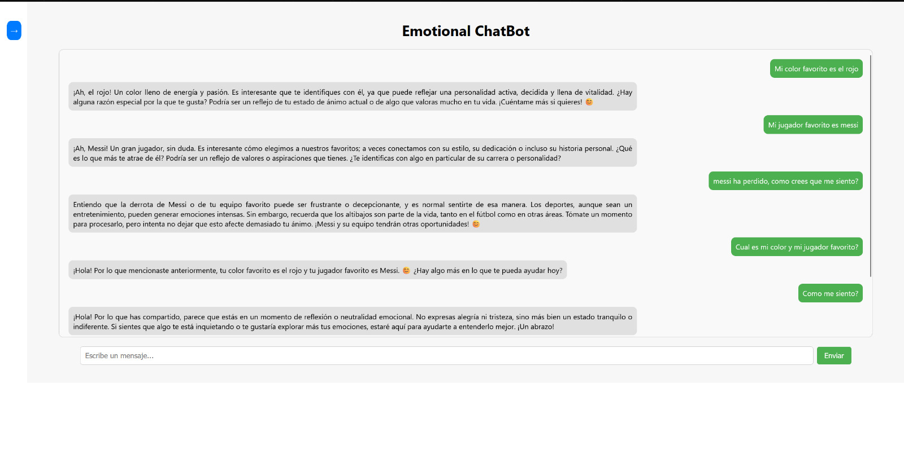
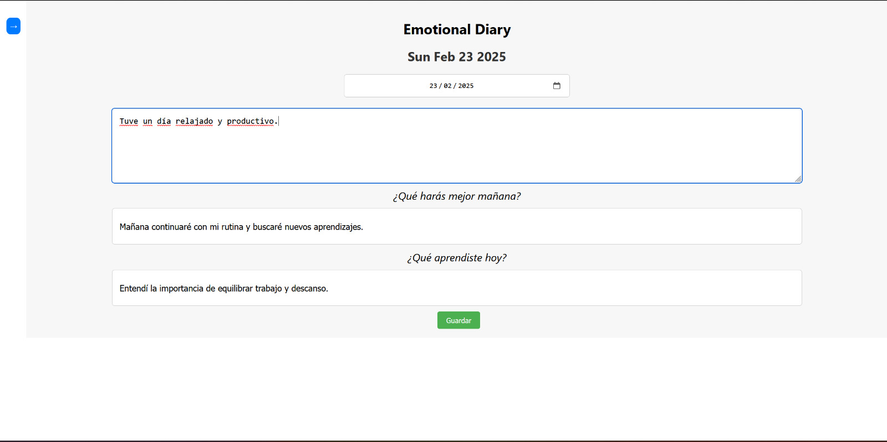
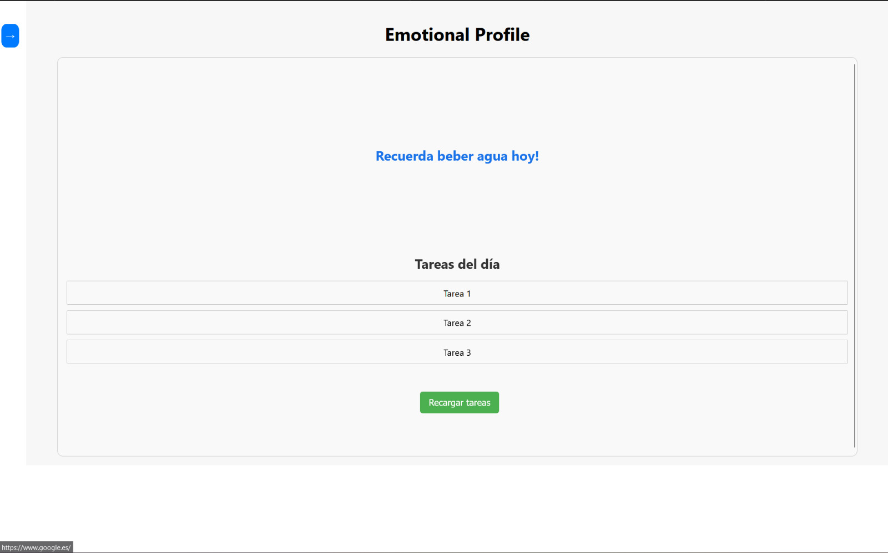

# 🚀 Proyecto H4CKUDC 2025

Bienvenido/a al repositorio de nuestro proyecto desarrollado para **HackUDC**.  
Aquí encontrarás el código que conforma todo nuestro trabajo realizado.

## 📌 Descripción

Este proyecto fue desarrollado en **HackUDC 2025**, con el objetivo de cumplir con el reto propuesto por la empresa KELEA.  

Nuestra aplicación utiliza:
- **Deepseek + OpenRoute API** como modelo LLM.
- **EmoRoBERTa** para el análisis de emociones.
- **Weaviate** como base de datos vectorial para almacenamiento.

Empleando las tecnologías:
- **React** - Para la capa de _frontend_.
- **Python** - Para la capa de _backend_.
- **Socket.IO** - Para la interconexión entre estas dos capas.

## ⚡ Características principales

✅ [Funcionalidad 1]: **Chatbot de Apoyo Emocional** con análisis de sentimientos y emociones en tiempo real.

✅ [Funcionalidad 2]: **Diario Emocional Inteligente**, que permite a los usuarios escribir sobre su día.

✅ [Funcionalidad 3]: **Sistema de perfilado de personalidad**, para la clasificación de personalidad según modelos psicológicos.

✅ [Funcionalidad 4]: **Coach de Bienestar y Objetivos**, que propone objetivos personalizados basados en el estado emocional detectado.

## 📷 Capturas de Pantalla  

### 💬 Chatbot de Apoyo Emocional  

### 📝 Diario Emocional Inteligente  

### 📝 Perfil personalizado  

## 👥 Equipo

- **David Dans Villares** - [3º GEI - FIC]
- **Fernando Losada Pérez** - [3º GEI - FIC]  
- **Brais Olveira Santiago** - [3º GEI - FIC]  

## 📄 Licencia

Este proyecto está bajo la licencia [MIT](LICENSE).  
Consulta el archivo `LICENSE` para más detalles.

